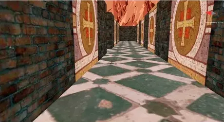
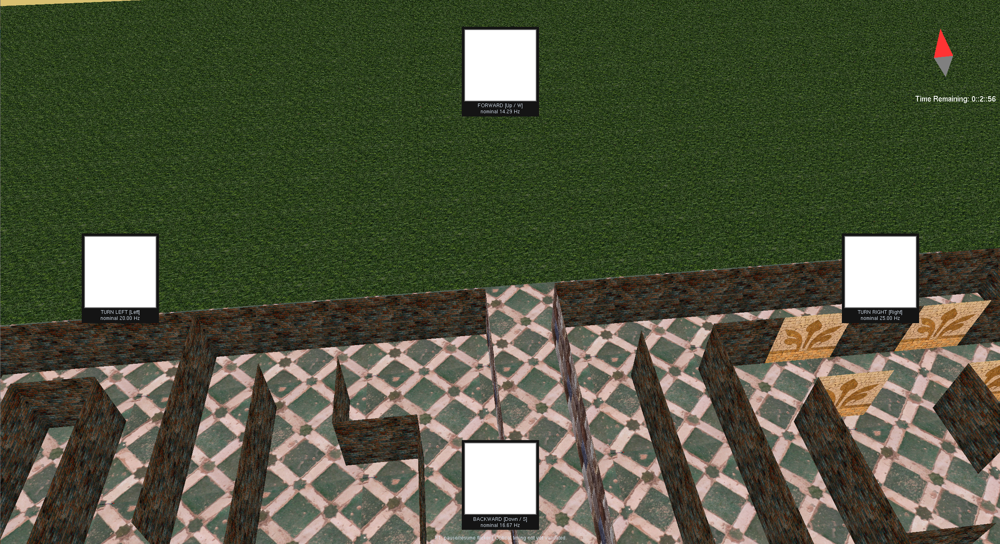

# SSVEP–CCA-Based EEG Navigation

A research project investigating EEG-based control of a 3D maze using steady-state visual evoked potentials (SSVEP) and canonical correlation analysis (CCA). The existing C++/OpenGL/FreeGLUT environment provides a testbed for evaluating neural command decoding and closed-loop navigation.

**Current status:** manual navigation, four frame-sequenced visual targets, and a BPW34/MG24 optical measurement tool are implemented. Optical validation of the maze targets, EEG acquisition integration, CCA decoding, and neural control remain pending; this repository does not yet provide a working EEG-controlled system.

## Research direction

The planned interface associates four flickering visual targets with **forward, backward, turn left, and turn right** commands. CCA will compare windows of multichannel EEG with reference signals at the stimulus frequencies and their harmonics. Confidence thresholds and temporal evidence accumulation will determine when to execute a command.

Planned pipeline:

```text
EEG acquisition → preprocessing → SSVEP/CCA decoding
    → confidence and temporal decision logic → navigation command
```

Initial work will focus on:

- Four fixed screen-space targets, with photodiode validation of their optical frequency and timing.
- Integration of the planned four-channel EEG acquisition system.
- Calibration and evaluation of stimulus frequencies, EEG window lengths, and decision thresholds.
- Evaluation of decoding accuracy, false activations, command latency, maze completion time, and path efficiency.
- Comparison of direct decoding, confidence-gated control, and environment-aware command filtering.

## Branches

- **`main`**: ongoing SSVEP–CCA research and integration, built on the existing navigation environment.
- **`codex/opengl-game`**: preserved OpenGL game baseline before the research reorganization.

## Existing navigation environment

Originally developed for **UCSB CS280, Spring 2022**, the environment includes collision-aware movement, mouse look, strafing and jumping, a compass and timer HUD, and maze layouts loaded from text files.

<p align="center">
  <a href="https://youtu.be/9cJ7eTtbbqo">
    
  </a>
</p>
<p align="center">
  <em>The existing navigation environment used as the testbed for the planned BCI extension. <a href="https://youtu.be/9cJ7eTtbbqo">Watch the environment demo</a>.</em>
</p>

### Manual controls

- **W/S or up/down arrows:** move forward/backward.
- **A/D:** strafe left/right.
- **Left/right arrows:** turn the viewpoint.
- **Mouse:** change viewing direction.
- **Spacebar:** jump.
- **Escape:** exit.

These are the current manual controls; the planned BCI left/right commands will turn the viewpoint.

### Visual targets

For optical frequency checks, use the [BPW34 + XIAO MG24 validation sketch and setup guide](firmware/photodiode_validation/README.md). It reads the photodiode on **D10**, records a buffered capture, reports frequency and timing statistics, and exports raw CSV data.

<p align="center">
  
</p>
<p align="center">
  <em>Four directional SSVEP targets overlaid on the maze. This screenshot captures their appearance at one instant; it does not show or validate flicker timing.</em>
</p>

Four opaque black/white squares are anchored at top center (forward), bottom center (backward), left center (turn left), and right center (turn right). Their centers are inset to 12%/88% of the viewport; their size scales from 140 pixels at 1920 x 1080. Static labels sit outside the flickering area, and the upper-right compass/timer remains in place.

- **F1:** pause/resume flicker. Paused targets remain visible in gray; resuming restarts their frame sequence.
- Flicker pauses during victory/game-over screens.
- VSync is requested at startup. If unavailable, targets start paused; F1 can enable an unvalidated preview.

Provisional sequences (one sequence step per buffer swap). Assuming one swap per display refresh, **nominal stimulus frequency = monitor refresh rate / total frames per cycle**. Values below are in Hz, rounded to two decimal places; they are calculated fundamentals, not measured optical output.

| Target | Bright/dark frames | 60 Hz monitor | 75 Hz monitor | 90 Hz monitor | 100 Hz monitor | 120 Hz monitor |
|---|---|---|---|---|---|---|
| Forward | 3 / 4 | 8.57 | 10.71 | 12.86 | 14.29 | 17.14 |
| Backward | 3 / 3 | 10.00 | 12.50 | 15.00 | 16.67 | 20.00 |
| Turn left | 2 / 3 | 12.00 | 15.00 | 18.00 | 20.00 | 24.00 |
| Turn right | 2 / 2 | 15.00 | 18.75 | 22.50 | 25.00 | 30.00 |

**Relation to gamma:** gamma is commonly described as approximately 30–80 Hz, with boundaries varying across studies ([human visual cortex study](https://pubmed.ncbi.nlm.nih.gov/24855114/)). These fundamentals span 8.57–30 Hz across the listed refresh rates: most are below gamma, and the right target at 120 Hz reaches its commonly used lower boundary. They are therefore not all "within gamma," nor strictly below 30 Hz. Gamma-band boundaries are not a stimulation safety or comfort limit. Harmonics used by CCA can extend into and above gamma; for example, a 30 Hz fundamental has second and third harmonics at 60 and 90 Hz. Select acquisition/filter bandwidth and CCA references for the harmonics actually used.

The named `SSVEP_*` settings and target table in `Constants.cpp` define frame periods, positions, reference resolution, target size, and spacing. Target dimensions are derived from the viewport at runtime; bitmap-label spacing stays in pixels. Odd periods have unequal bright/dark durations. Frequencies scale with display refresh rate; labels use the OS-reported rate, not an optical measurement. Driver overrides, variable refresh, missed refreshes, and compositor behavior can change actual timing. Use fixed refresh and validate every target with a photodiode while navigating before EEG experiments. These provisional frequencies are not a calibrated CCA configuration; assess harmonic overlap and decoding performance before selecting the final set.

The initial stimulus is solid monochrome to simplify timing measurements. Colored or patterned stimuli require separate contrast and decoding validation; the stimulus does not inherit maze lighting or textures.

## Optical measurement tool and validation status

The [Arduino sketch and wiring guide](firmware/photodiode_validation/README.md) use a BPW34 photodiode, a load resistor, and the XIAO MG24's **D10** analog input. Each capture buffers 4,000 samples at a nominal 2 kHz (approximately 2 seconds, 24 kB of sample/timestamp storage), then reports frequency, period variation, ADC range, and sampling gaps. Commands: **`r`** records, **`d`** exports CSV, and **`h`** shows help.

**Validation status:** firmware has been uploaded and exercised on hardware. End-to-end optical validation of the maze targets remains pending.

Host-side tests cover synthetic target frequencies, weak/flat signals, clipping, and sampling gaps. These tests support the analysis implementation but do not validate the analog circuit or display output. Validation involves checking dark/steady-light response, inspecting captured waveforms, and measuring all four maze targets under navigation load.

## Background and demo

- **Portable Windows x86 baseline:** [Play_Game.zip](../../raw/refs/heads/codex/opengl-game/resources/Play_Game.zip) (launch using `Play_Game.bat`).
- **Environment demo:** [Video](https://www.youtube.com/watch?v=9cJ7eTtbbqo).
- **Original course assignment explanation:** [Video](https://www.youtube.com/watch?v=O8dUZq9Oty0).
- **Original course assignment:** [HW1.pdf](resources/HW1.pdf).
